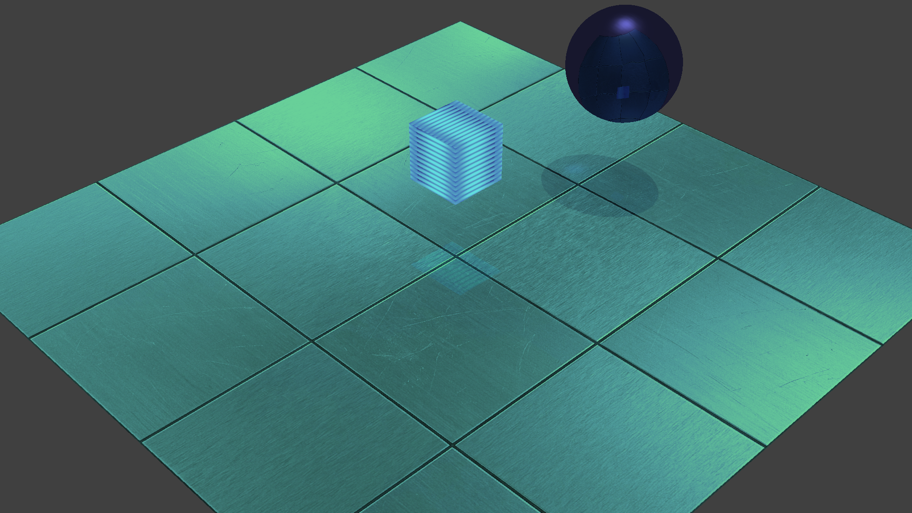

# DYReflect
**DYReflect** is a rendering module for simulating physically plausible reflections in the Ursina engine. 
It supports specular highlights and normal maps for surface detail. 
Optimized for small-scale environments, it balances visual quality with performance for real-time scenes.

